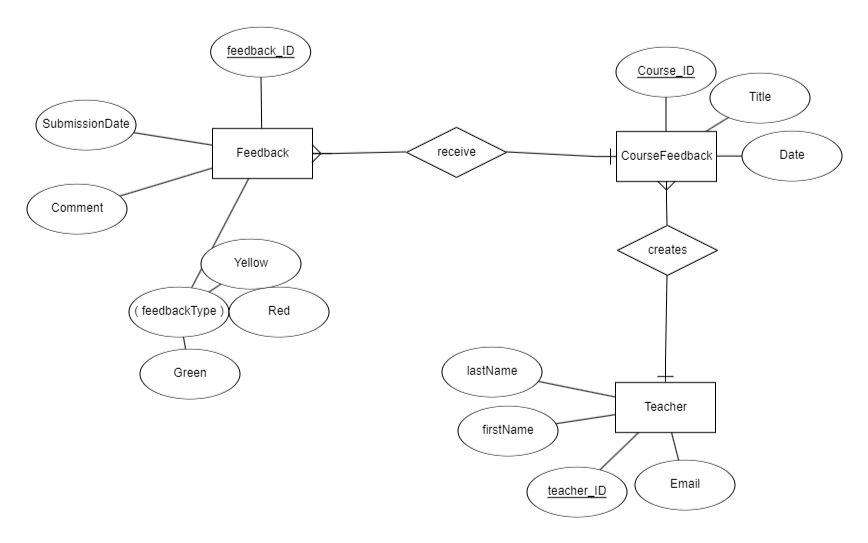
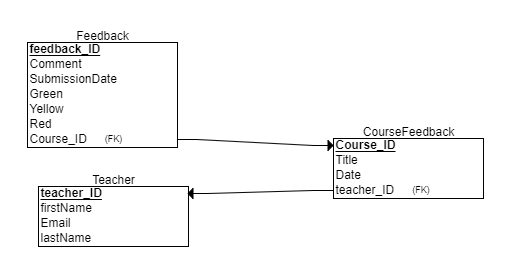

# Rocket Feedback application

#### This project has been built with JavaFX and uses Java as its programming language. 

### Vision:
##### This project is to produce an application where students can fill out a survey/feedback form. The project is made for university students to communicate their feedback and concerns to teachers. After each lesson the students will fill out a form about the lesson and send it to their course teacher.

### Problem statement:
##### Users in our target demographic, in this case meaning students, often struggle with voicing their opinions about lectures and courses. Whether these issues are about the learnt subject, teaching style or just a suggestion for improvement etc. students would greatly benefit from having a safe anonymous avenue where to express their concerns and opinions.

### Benefit:
##### Our goal is to bridge the gap between students and teachers when it comes to communication. We  want to create a low threshold for students to communicate with their teachers in order to make the learning experience more positive and rewarding. 

## Table of Contents
- [Installation](#Installation)
- [Usage](#Usage)
- [Technologies](#Technologies)
- [Contributing](#Contributing)
- [Testing](#Testing)
- [Project_Structure](#Project_Structure)
- [ER-Diagram](#ER-Diagram)
- [Relational_Schema](#Relational_Schema)


## Installation

#### How to get started with the Rocket feedback:
#### 1. Clone the github repository: 
```bash 
git clone https://github.com/S3ki/Rocket-Feedback
```

#### 2. Run mvn clean in case you have previous builds:
```bash
mvn clean
```

#### 3. Run mvn install:
```bash
mvn install
```

#### 4. Run the application
```bash
mvn javafx:run
```
## Usage

### Scenario 1. Student client
#### In the case of a client that is a student leaving a feedback:
- Open the application
- Students don't need to create a separate user they can just log in 
- Once logged, the user will be given a window where to choose a courses
- Then the user will choose the desired course
- The course feedback window will open
- The user will write their feedback and submit it
- Now the feedback will show on the teachers feedback feed

## Technologies

- Java: a programming language
- JavaFX: a software platform used to build rich client applications that run on desktop, mobile, and embedded systems
- MariaDB: one of the most popular open source relational databases
- Scene builder: a visual layout tool for designing user interfaces (UIs) in JavaFX
- JUnit: a popular unit testing framework for Java applications
- JaCoCo: (Java Code Coverage) is a popular code coverage library for Java projects
- Maven: a software project management and comprehension tool

## Contributing

#### If you would like to contribute to Rocket feedback here are the steps to do so:
1. Fork the repository
2. Create a new branch `(git checkout -b feature/your-feature)`
3. Make your changes
4. Commit your changes `(git commit -am 'Add some feature')`
5. Push to the branch `(git push origin feature/your-feature)`
6. Create a new Pull Request

## Testing

#### To run tests navigate to your directory and run the following command:
```bash
mvn test
```
## Project_Structure

1. Backend:
   - src/main/java/Dao/
       - `OpettajaDao.java` Handles database operations related to "Opettaja".
   - src/main/java/Datasource/
       - `MariaDbJpaConnection.java` Manages the connection to the MariaDB database using JPA.
       - `DatabaseStructure.java` Defines the structure and schema of the database.
   - src/main/java/Entity/
      - `Feedback.java` Represents the feedback entity (data model).
      - `Kurssi.java` Represents the course entity.
      - `Opettaja.java` Represents the teacher entity.
   - src/main/java/Model/
      - `FeedBack.java` Core model for feedback functionality.
      - `Kurssi.java` Model for course data.
      - `Opettaja.java` Model for teacher data.
   - src/main/java/main2/
      - `OpettajanToiminnot.java` Backend logic for teacher functionalities.
      - `OppilasToiminnot.java` Backend logic for student functionalities.

2. Frontend
   - src/main/java/Gui/
      - `FeedbackAppGUI.java` Main class that handles the graphical user interface (GUI) of the application.
   - src/main/resources/
      - FXML Files (for defining GUI layouts):
           - `design.fxml` General design for the application's UI.
           - `kirjaudu.fxml` Layout for the login screen.
           - `opettajanToiminnot.fxml` Layout for teacher operations.
           - `oppilaskurssit.fxml` Layout for student courses.
           - `oppilaspalaute.fxml` Layout for student feedback.
           - `palaute.fxml` Layout for feedback submission.
           - `palautusjärjestelmä.fxml` Layout for the feedback system.
           - `saapuneetpalautteet.fxml` Layout for viewing received feedback.
      - Other Resources:
           - `style.css` Stylesheet for the application's UI, managing the visual design.
           - `logback.xml` Configuration file for logging.
   - src/main/java/SceneGui/
        - Manages transitions between different GUI scenes

3. .gitignore
   - Specifies files and directories to be excluded from version control. 

## ER-Diagram



## Relational_Schema




